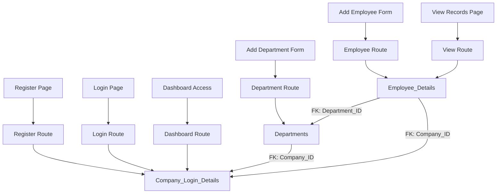

# 🧾 Employee Management Application

This is a full-stack **Employee Management Web Application** built using **Python (Flask)** for the backend and **PostgreSQL** for data storage. It allows companies to register, log in, and manage their employees effectively.

---

## 📦 Features

- 🏢 Company Registration and Login
- 👤 Add, Edit, and View Employee Records
- 🔒 Secure authentication using session management
- 🗃️ PostgreSQL-based relational database with proper foreign key constraints
- 🧮 Form validation and error handling
- 📋 Clean and simple UI (HTML + CSS Bootstrap)

---

## ⚙️ Technologies Used

- Backend: Python (Flask)
- Frontend: HTML, CSS (Bootstrap)
- Database: PostgreSQL
- Templating: Jinja2

---

## 💾 Database
Run the database.sql file to create the required database for this project, or use pgAdmin to create the database using the structure defined in the SQL file.

---
## 🏗️ Application Architecture (3-Table Design)



---
## 🏗️ Project Structure


```bash
employee_application/
├── app.py                          # Main Flask application
├── requirements.txt                # Python dependencies
├── .env                            # Environment variables (DB credentials, secret key)
├── README.md                       # Project documentation
├── ARCHITECTURE.md                 # Architecture and Mermaid diagrams
│
├── /templates/                     # HTML templates
│   ├── home.html
│   ├── login.html
│   ├── register.html
│   ├── dashboard.html
│   ├── employee.html
│   ├── department.html
│   └── view.html
│
├── /static/                        # Static assets (optional: CSS, JS, images)
│   ├── styles.css
│   └── logo.png
│
├── /sql/                           # SQL setup scripts
│   └── schema.sql                  # CREATE TABLE statements for all 3 tables

```
## 🏗️ Env Structure

---

```env
DATABASE_URL= Use_your_External_URL
SECRET_KEY= Secret_Key_For_Flash

```
